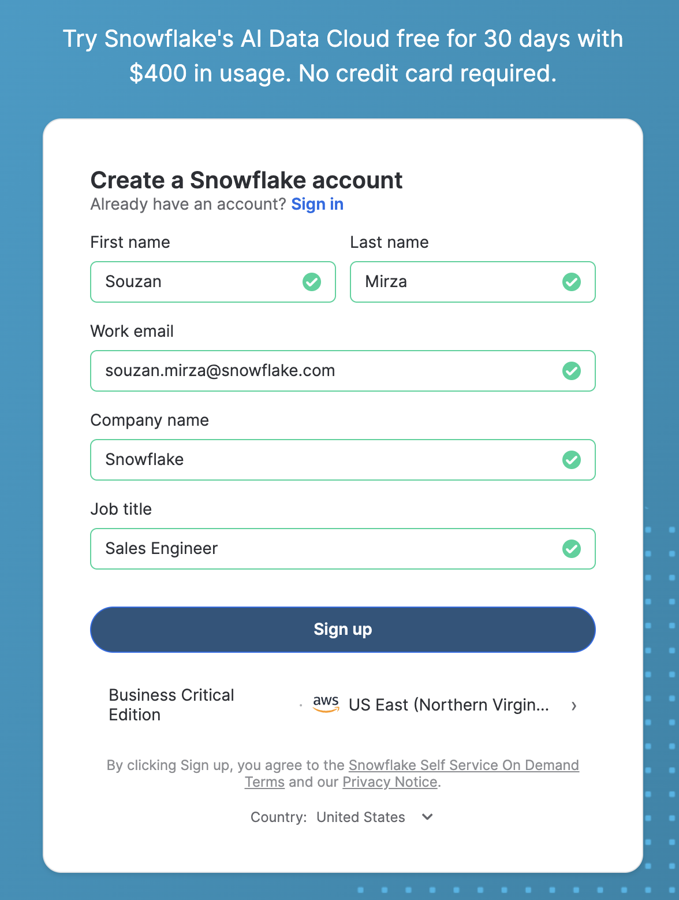
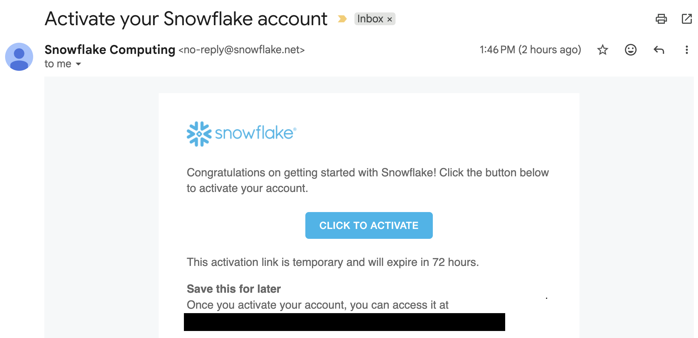

Step 1:
Setup a snowflake trial account: 
[Docs](https://docs.snowflake.com/en/user-guide/admin-trial-account).
[Trial Account Webpage](https://signup.snowflake.com/)

Ensure to chose the right region & distribution:



Check your email and create a unique username and password.



```sql
Step 2: Setup a github integration in your trial account.
CREATE OR REPLACE API INTEGRATION my_git_api_integration
  API_PROVIDER = git_https_api
  API_ALLOWED_PREFIXES = ('https://github.com/')
  ENABLED = TRUE;
```

Step 3: Clone the repos for the labs.

Step 4: Run the labs and read the instructions and code comments.

If you need help just raise your hand!